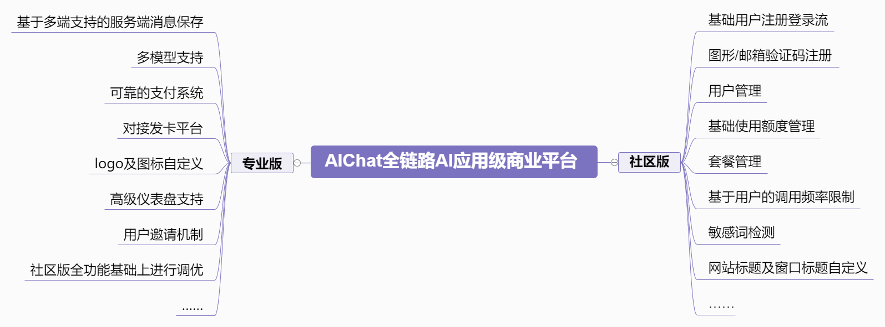
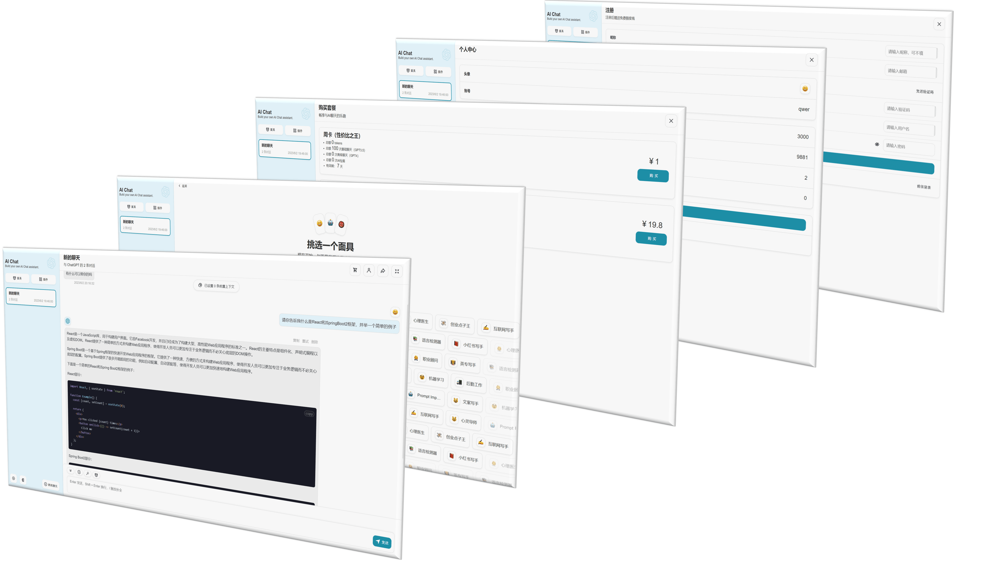
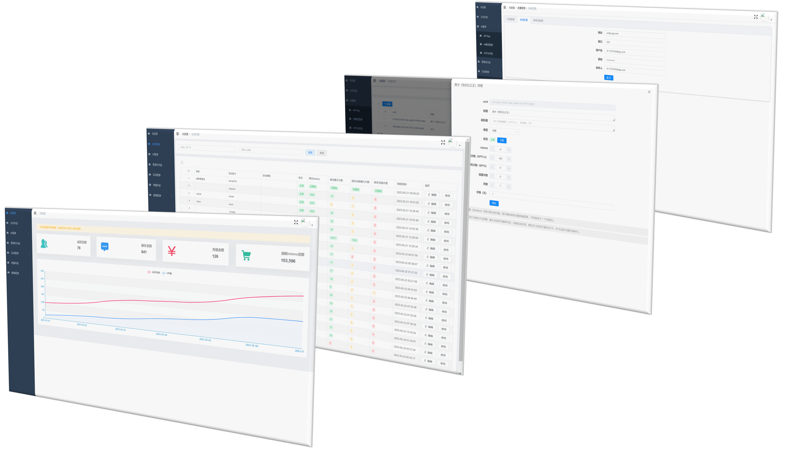
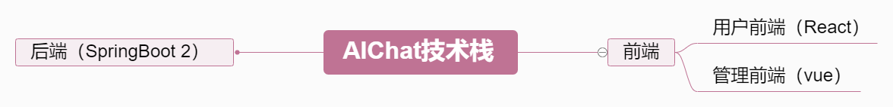

> **注意：本项目不再支持在vercel上进行部署**

<h1 align="center">AIChat</h1>

**简体中文** | [**English**](./README_EN.md)

本项目基于[ChatGPT-Next-Web](https://github.com/Yidadaa/ChatGPT-Next-Web.git)开源项目进行二次开发，增加用户注册登录、用户管理、套餐管理等功能，并提供可自行部署的解决方案。

<table>
    <tbody>
      <tr>
        <td>
          <a href="https://nanjiren.online/">🌐 官方网站</a>
        </td>
        <td>
          <a href="https://www.nanjiren.online/start/demo/">🎦 演示站点</a>
        </td>
        <td>
          <a href="https://www.nanjiren.online/start/deploy/">🚀 一键部署</a>
        </td>
        <td>
          <a href="https://www.nanjiren.online/excellentcase/">👑 优秀案例</a>
        </td>
        <td>
          <a href="https://www.nanjiren.online/updatelog/">📝 更新日志</a>
        </td>        
        <td>
          <a href="https://www.nanjiren.online/cooperation-communication/">💬 交流讨论</a>
        </td>
      </tr>
    </tbody>
  </table>

## 🤩 版本功能

## 😍 平台预览

**用户平台端**

**用户管理端**

## 🎯 开发计划
**社区版**

| 功能                                                      | 进度 |
| --------------------------------------------------------- | -------- |
| 用户管理                                             |    ✔已完成     |
| 额度管理                                             |    ✔已完成     |
| 套餐定制                                              |   ✔已完成      |
| 注册额度赠送                                          |    ✔已完成     |
| 邮箱验证码注册                                        |    ✔已完成     |
| 图形验证码注册                                        |    ✔已完成     |
| 自定义敏感词拦截                                       |   ✔已完成       |
| 基于用户的调用频率限制                                 |   ✔已完成       |
| 网站标题及窗口标题定制                                 |   ✔已完成      |
| 修改密码                                              |   进行中       |
| 绘图功能                                              |   进行中       |

[**专业版**](https://www.nanjiren.online/price/)

| 功能                                                         | 进度     |
| ------------------------------------------------------------ | -------- |
| 增强型社区版全功能支持                                  | ✔已完成        |
| 多模型支持                                             | 长期进行 |
| 仪表盘                                                | 进行中   |
| 邀请机制                                              | 进行中   |
| 对接支付系统                                           | 进行中   |
| 对接发卡平台                                           | 进行中   |
| 服务端消息保存                                         | 进行中   |

## 🎮 技术栈

## 🐵 开发组
- [@Nanjiren01](https://github.com/Nanjiren01)
- [@yeguangsuixing](https://github.com/yeguangsuixing)
- [@zeraturing](https://github.com/zeraturing)
- [@AI-ASS](https://github.com/AI-ASS)

## 📖 许可证 
本仓库是基于仓库 [Yidadaa's ChatGPT-Next-Web](https://github.com/Yidadaa/ChatGPT-Next-Web) 的996许可证，以 [MIT许可证](./LICENSE) 的形式重新分发。

