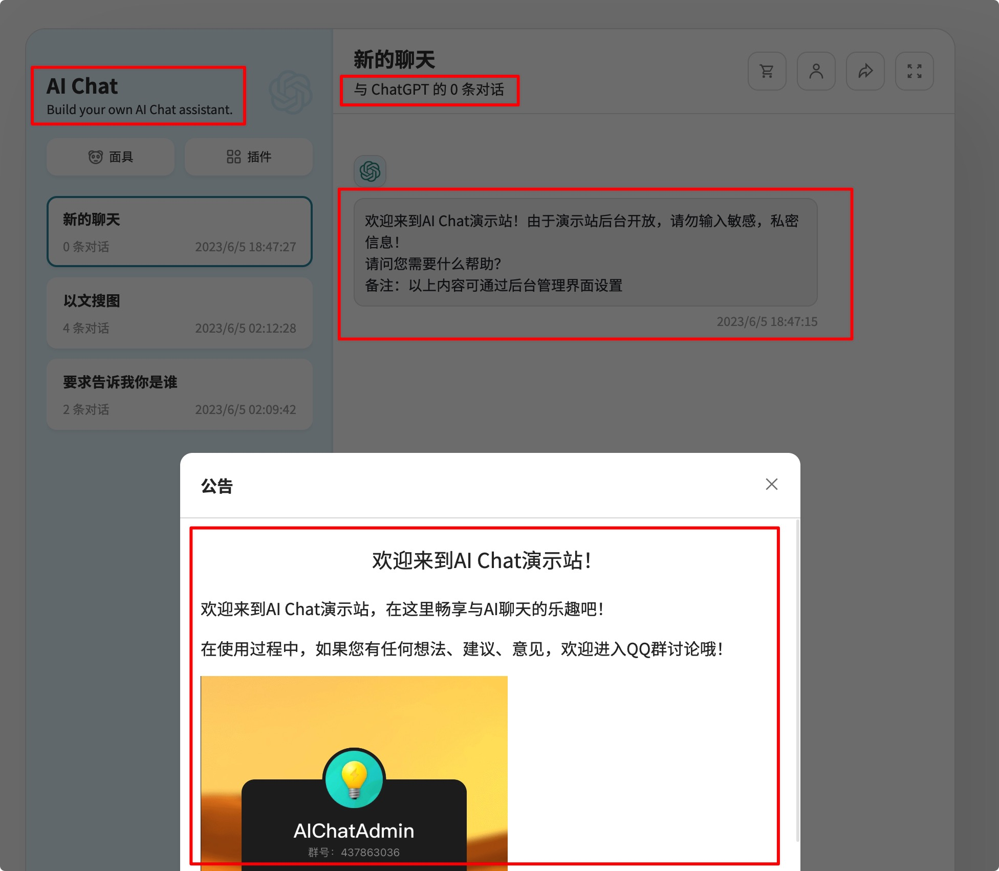
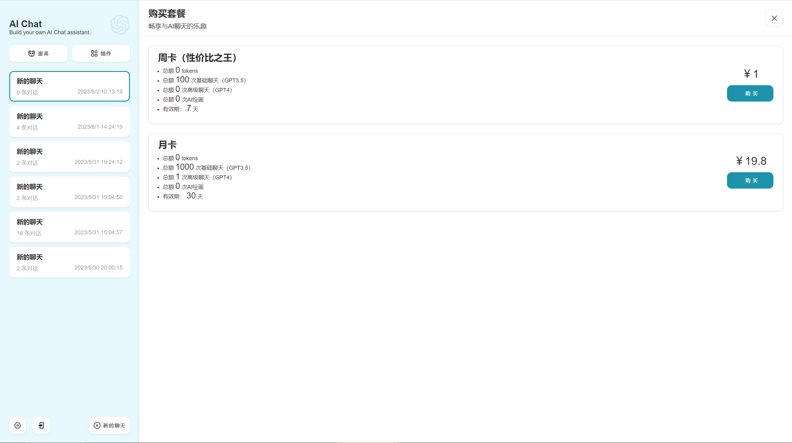
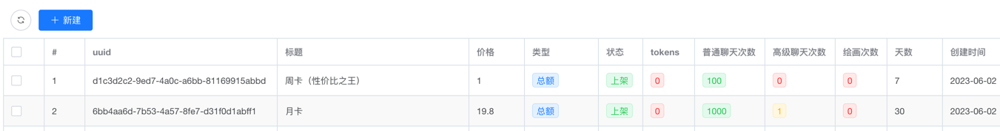
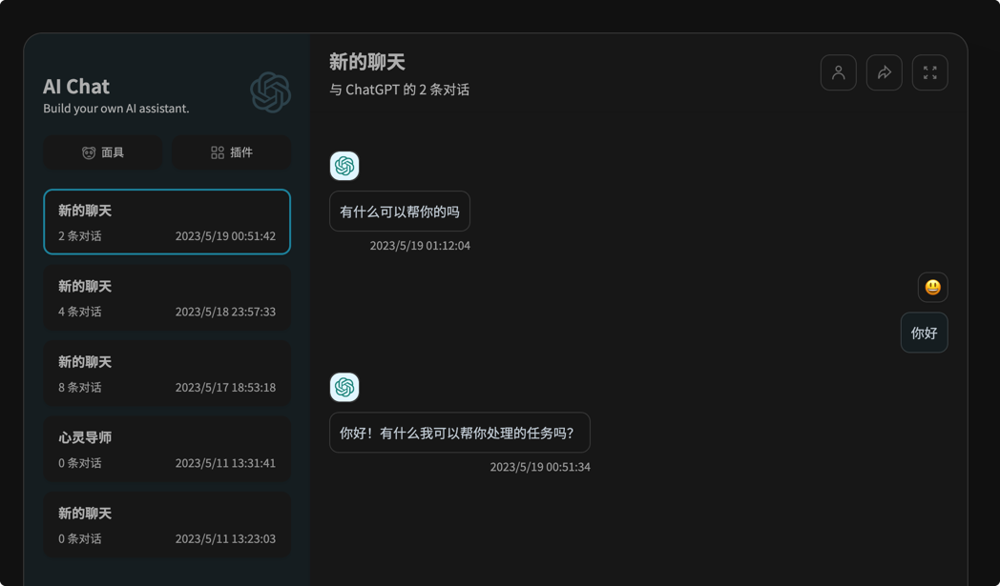
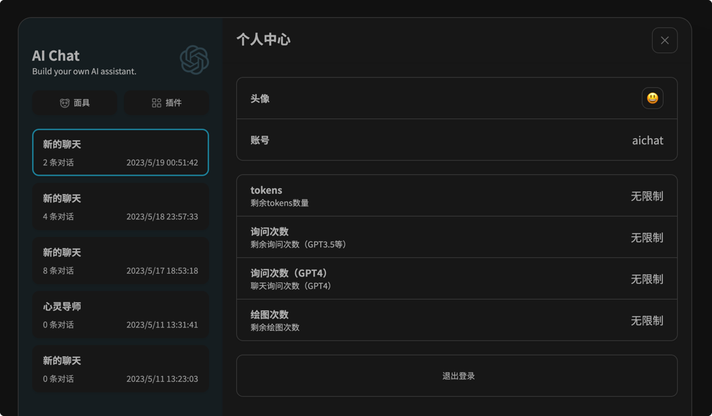
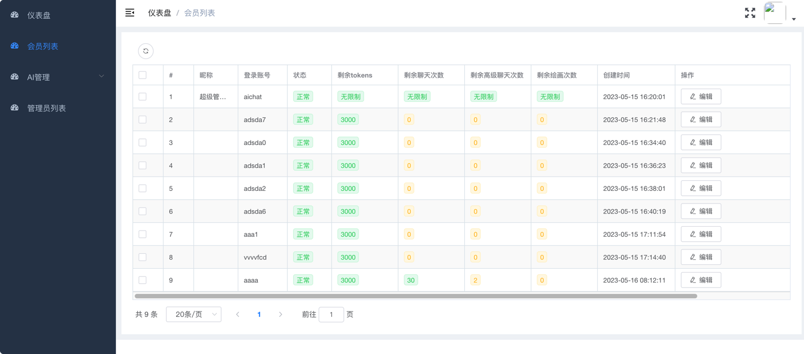
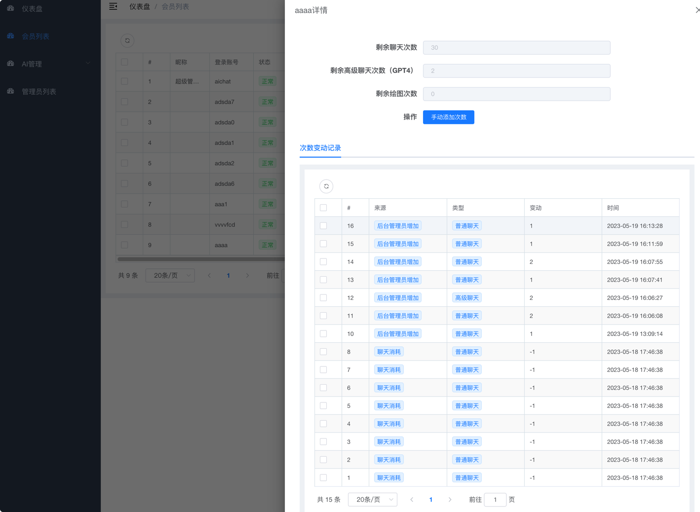

> 特别提醒：此项目应仅限于学习和交流使用，如若用于商业用途，请确保符合当地法律法规

<div align="center" style="margin-bottom: 10px;">

  
<h1 align="center">AIChat Web</h1>

**简体中文** | [English](#english)


  <table>
    <tbody>
      <tr>
        <td>
         <a href="#一键部署">📝一键部署</a> 
        </td>
        <td>
         <a href="https://www.nanjiren.online" target="_blank">🌏官网</a>
        </td>
        <td>
         <a href="#演示站">🎭演示站</a>
        </td>
        <td> 
         <a href="#项目优势">😍项目优势</a> 
        </td>
        <td>
         <a href="#交流">💬交流</a>
        </td>
        <td> 
         <a href="#ai好望角">👨‍👩‍👧‍👦社区论坛</a>
        </td>
        <td> 
         <a href="#优秀案例">📕优秀案例</a>
        </td>
      </tr>
    </tbody>
  </table>


</div>

本项目是在[ChatGPT-Next-Web](https://github.com/Yidadaa/ChatGPT-Next-Web.git)的基础上增加登录，注册等功能（注意，由于登录注册需要后台支持，因此本项目需要单独部署后端服务才可以运行）

> **本项目不再支持在vercel上正常运行**

---

## 演示站

- 用户前台：[https://chat.nanjiren.online](https://chat.nanjiren.online)
- 管理后台：[https://admin.nanjiren.online](https://admin.nanjiren.online)

**登录信息：**
- 账号：aichat
- 密码：aichatadmin

> **温馨提示：由于后台开放，请勿在演示站中输入敏感信息。**

## 项目优势

### 1、零基础，不会敲代码也可以搭建

快速：项目提供一键部署脚本，采购服务器后只需执行一键部署脚本即可搭建，整个过程最快不超过3分钟。

简单：部署后，进入提供的管理后台，即可定义自己站点的内容，无需修改任何代码，无需构建部署环节，即改即生效。

### 2、高度自定义

项目提供方便易用，成熟稳定的管理后台（基于[vue-element-admin](https://panjiachen.github.io/vue-element-admin)），绝大部分内容可以在后台直接设定。

#### 2.1、网站标题、欢迎词、公告自定义

可以自定义网站标题，副标题；
可以自定义欢迎词，支持富文本格式，您可以在此处添加图片（例如二维码）进行引流；
可以编辑公告，同样支持富文本格式，您可以在此处展示使用声明、通知，可以选择是否开屏展示；



#### 2.2、套餐玩法自定义

次卡？周卡？月卡？统统可以在后台定义。





#### 2.3、更多自定义内容

在后台管理中，您还可以设定注册方式（支持用户名+密码方式、图形验证码方式、邮箱注册方式），各页面主副标题，出现敏感词时的提示语，额度不足提示语……

## 社区版功能

| 功能                                                      | 进度 |
| --------------------------------------------------------- | -------- |
| 用户管理                               |    ✔已完成(v0.0.1)     |
| 额度管理                              |    ✔已完成(v0.1)     |
| 注册额度赠送                       |    ✔已完成(v0.1)     |
| 邮箱验证码注册    |    ✔已完成(v0.1)     |
| 调用频率限制 |   ✔已完成(v0.1)       |
| 图形验证码注册  |    ✔已完成(v0.2)     |
| 网站标题                   |   ✔已完成(v0.2)      |
| 套餐管理                            |   ✔已完成(v0.2)      |
| 自定义敏感词拦截    |   ✔已完成(v0.2)   |
| 忘记/重置密码                           |   ✔已完成(v0.4)   |
| API KEY余额自动查询            |   ✔已完成(v0.4)   |
| 忘记密码                           |   ✔已完成(v0.4)       |
| 第三方API状态余额查询                                      |   ✔已完成(v0.6) |
| 绘图功能                              |   进行中       |

## 专业版功能

| 功能                                                         | 进度     |
| ------------------------------------------------------------ | -------- |
| 社区版的全功能 | ✔        |
| 仪表盘                                | ✔已完成(v0.3)  |
| 对接支付系统            | ✔已接入虎皮椒、蓝兔(v0.3)，其他进行中   |
| 邮件模板                                | ✔已完成(v0.5)  |
| 邀请机制                                | ✔已完成(v0.5)  |
| 微信登录                                | ✔已完成(v0.5)  |
| 后台查看聊天记录                                | ✔已完成(v0.5)  |
| 模型名称重映射                                | ✔已完成(v0.5)  |
| 兑换码                                | ✔已完成(v0.7)  |
| 面具管理                                | ✔已完成(v0.7)  |
| 独立注册登录界面                                | ✔已完成(v0.7)  |
| key余额协议配置                                | ✔已完成(v0.7)  |
| 更多UI自定义                                | ✔已完成(v0.7)  |
| 对接发卡平台          | 进行中   |
| 多模型支持                         | 长期进行 |

## 预览

> 用户前台
### 1、聊天



### 2、登录


### 3、注册


### 4、个人中心



> 管理后台

### 1、会员列表



### 2、次数变动记录/手动添加次数



## 依赖
本项目需要依赖特定的[**后端**](https://github.com/Nanjiren01/AIChatAdmin)，以及相应的[**管理后台前端项目**](https://github.com/Nanjiren01/AIChatConsole)。

## 一键部署

> 如果使用宝塔，请登录好望角参照内测专属频道获取教程

1. 在云厂商购买一台合适配置的服务器，操作系统选择CentOS 7.9（其他版本未测试）
2. 在安全组中放行80端口和8080端口
3. 连接云服务器，在命令行中运行以下代码

```shell
bash <(curl -s https://raw.githubusercontent.com/Nanjiren01/AIChatWeb/main/scripts/setup.sh)
```

命令运行过程中，需要设置超级管理员的账号和密码（请将aichat888更改为自己的账号密码并牢记），如下所示：

```text
Please input the super admin username. 
Only letters and numbers are supported, the length should between 6 and 20, and they cannot start with a number.
Username: aichat888
Super Admin Username is valid.
Please input the super admin password. 
Only letters and numbers are supported, and the length should between 6 and 20. 
You can change it on the web page after the Application running
Password: aichat888
Super Admin Password is valid.
```

当出现以下提示，说明部署成功

```shell
[+] Running 5/5
 ✔ Network root_default      Created
 ✔ Container aichat-db       Started
 ✔ Container aichat-admin    Started
 ✔ Container aichat-console  Started
 ✔ Container aichat-web      Started         
```

稍等几秒钟应用初始化，即可打开http://IP访问前台页面，打开http://IP:8080访问后台服务。

由于在命令行中设定的密码较为简单（只包含字母和数字），建议应用启动后，尽快进入后台修改超管密码。

## 许可证 
本仓库是基于仓库 [Yidadaa's ChatGPT-Next-Web](https://github.com/Yidadaa/ChatGPT-Next-Web) 的996许可证，以[MIT license](./LICENSE)的形式重新分发。

## 交流

> 加入QQ交流群、电报群、微信群获取更多内容

QQ群：<a target="_blank" href="https://qm.qq.com/cgi-bin/qm/qr?k=Z-vLdIURiLJW7IInTMfRPnjFF2w5biv9&jump_from=webapi&authKey=xwz1vwqsxZvdsYVqbs8jhUz85CnwKAnNq2MLmfAewdOvtgQrX99I1i3DpNx4AnM5" target="_blank">437863036</a>

Telegram：<a target="_blank" href="https://t.me/aichatadmin">aichatadmin</a>


## AI好望角

加入 **AI好望角-AIChat用户专属社区** 福利：
- 免费获取AIChat pro版
- 有可能获得免费定制服务
- 优秀案例展示（需达到标准）
- 高级教程（包括HTTPS搭建、域名注册、服务器购买、高级套餐页制作）
- ChatGPT高级使用手册
- 新功能优先体验

> 当前项目为试运行阶段，部分内容仍在筹备中

> AI好望角为本项目自建平台，目前仍在筹建中，只能以赞赏形式加入（不支持退款），赞赏后可立即进入AIChatAdmin专业版内测群获取专业版专属信息。
> 新平台筹建完毕后，会将知识星球中的内容迁移至新平台，新用户无需进入星球。

当前加入AI好望角价格为218元，随着功能的不断完善，价格逐步提升


## 优秀案例

### YOURS-AI
网址：[https://junmao.shop/](https://junmao.shop/)
用户：300+

### NEU-GPT
网址：[https://neu.zxyt.top/](https://neu.zxyt.top/)
用户：150+

### AI Ultra
网址：[https://chat.wzunjh.top/](https://chat.wzunjh.top/)
用户：1100+

### AI佩奇
网址：[https://candy666.top/](https://candy666.top/)
用户：~1000

### AI小老鼠
网址：[https://chat.mice.pub](https://chat.mice.pub)
用户：~1000

## 专业版规划路线

1. 对接支付系统
2. 邀请机制（邀请赠送额度）
3. 仪表盘（新增用户数曲线图、聊天数量曲线图）
4. 对接发卡平台
5. 服务端消息保存
6. 多模型支持（Claude、Bard……）

# English

> **Special Reminder:** This project should be used for learning and communication purposes only. If you intend to use it for commercial purposes, please ensure compliance with local laws and regulations.

<div align="center" style="margin-bottom: 10px;">


<h1 align="center">AIChat Web</h1>


  <table>
    <tbody>
      <tr>
        <td>
         <a href="#one-click-deployment">📝Deployment</a>
        </td>
        <td>
         <a href="https://www.nanjiren.online" target="_blank">🌏Website</a>
        </td>
        <td>
         <a href="#demo">🎭Demo</a>
        </td>
        <td> 
         <a href="#advantages">😍Advantages</a>
        </td>
        <td>
         <a href="#communication">💬Communication</a>
        </td>
        <td> 
         <a href="#ai-cape-of-good-hope">👨‍👩‍👧‍👦Forum</a>
        </td>
        <td> 
         <a href="#excellent-cases">📕Examples</a>
        </td>
      </tr>
    </tbody>
  </table>


</div>

This project is an extension of [ChatGPT-Next-Web](https://github.com/Yidadaa/ChatGPT-Next-Web.git) that includes features like login and registration. Please note that since login and registration require backend support, this project needs a separate deployment of backend services to run.

> **This project can NOT run on the vercel**

---

## Demo

- User Frontend: [https://chat.nanjiren.online](https://chat.nanjiren.online)
- Admin Backend: [https://admin.nanjiren.online](https://admin.nanjiren.online)

**Login Credentials:**
- Username: aichat
- Password: aichatadmin

> **Note: As the backend is open for demonstration purposes, please refrain from entering sensitive information in the demo site.**

## Advantages

### 1. Zero coding experience required

Quick: The project provides a one-click deployment script, allowing you to set up the project in less than 3 minutes after purchasing the server.

Simple: Once deployed, you can access the provided admin panel to define the content of your website without any code modification. Changes take effect immediately without the need for building or deploying.

### 2. Highly customizable

The project offers a user-friendly and stable admin panel (based on [vue-element-admin](https://panjiachen.github.io/vue-element-admin)) that allows you to customize most aspects of your website.

#### 2.1. Customizable website title, welcome message, and announcements

You can customize the website title and subtitle.
You can define a welcome message with support for rich text formatting. You can also add images (e.g., QR codes) to attract visitors.
You can edit announcements with rich text formatting as well. You can choose whether to display them on the splash screen.


#### 2.2. Customizable package options

Whether it's a one-time pass, weekly pass, or monthly pass, you can define all the package options in the admin panel.


#### 2.3. More customization options

In the admin panel, you can also set the registration method (supporting username + password, graphical captcha, and email registration), main and sub-titles for each page, prompt messages for sensitive words, insufficient balance, and more.

## Community Edition Features

| Feature                                                     | Progress |
| ----------------------------------------------------------- | -------- |
| User Management                                            | ✔ Completed (v0.0.1) |
| Quota Management                                           | ✔ Completed (v0.1) |
| Registration Limit Gift                                    | ✔ Completed (v0.1) |
| Email Verification Code Registration                       | ✔ Completed (v0.1) |
| User-Based Call Frequency Limit                            | ✔ Completed (v0.1) |
| Graphic Verification Code Registration                     | ✔ Completed (v0.2) |
| Website Title Customization                                | ✔ Completed (v0.2) |
| Package Management                                         | ✔ Completed (v0.2) |
| Custom Sensitive Word Interception                         | ✔ Completed (v0.2) |
| Reset Password                                             | ✔ Completed (v0.4) |
| Auto Query Balance/Quota                                   | ✔ Completed (v0.4) |
| Forgot Password                                            | ✔ Completed (v0.4) |
| Third-Party API Status and Balance Query                    | ✔ Completed (v0.6) |
| Drawing Function                                           | In Progress |

## Professional Edition Features

| Feature                                                     | Progress |
| ----------------------------------------------------------- | -------- |
| Full Functionality of the Community Version                 | ✔ Completed |
| Advanced Dashboard                                         | ✔ Completed (v0.3) |
| Integration with Payment System (Pay)                       | ✔ Integrated with Hupijiao and Lantu (v0.3), others in progress |
| Email Template                                             | ✔ Completed (v0.5) |
| Invitation Mechanism                                       | ✔ Completed (v0.5) |
| Wechat Login                                               | ✔ Completed (v0.5) |
| Chat Log Viewing                                           | ✔ Completed (v0.5) |
| Model Name Map                                             | ✔ Completed (v0.5) |
| Redeem Code                                                | ✔ Completed (v0.7) |
| Mask Management                                            | ✔ Completed (v0.7) |
| Independent Registration and Login Page                     | ✔ Completed (v0.7) |
| API Key Balance Protocol Configuration                     | ✔ Completed (v0.7) |
| More UI Customization                                      | ✔ Completed (v0.7) |
| Integration with Card Issuing Platforms                     | In Progress |
| Multiple Model Support                                     | Ongoing |

## Preview

> User Frontend
### 1. Chat


### 2. Login


### 3. Register


### 4. Profile


> Admin Backend

### 1. Member List


### 2. Quota Change History / Manual Quota Addition


## Dependencies
This project requires specific [**backend**](https://github.com/Nanjiren01/AIChatAdmin) and corresponding [**administration frontend project**](https://github.com/Nanjiren01/AIChatConsole).

## One-Click Deployment

> If you are using Baota, please refer to the exclusive beta channel in Haowangjiao for the tutorial.

1. Purchase a suitable server from a cloud provider, and choose CentOS 7.9 as the operating system (other versions are not tested).
2. Open port 80 and port 8080 in the security group of the server.
3. Connect to the cloud server and run the following command in the command line:

```shell
bash <(curl -s https://raw.githubusercontent.com/Nanjiren01/AIChatWeb/main/scripts/setup.sh)
```

During the execution of the command, you will be prompted to set the username and password for the super admin (please change "aichat888" to your own username and password and remember them), as shown below:

```text
Please input the super admin username. 
Only letters and numbers are supported, the length should be between 6 and 20, and they cannot start with a number.
Username: aichat888
Super Admin Username is valid.
Please input the super admin password. 
Only letters and numbers are supported, and the length should be between 6 and 20. 
You can change it on the web page after the application is running.
Password: aichat888
Super Admin Password is valid.
```

When you see the following prompt, it means the deployment is successful:

```shell
[+] Running 5/5
 ✔ Network root_default      Created
 ✔ Container aichat-db       Started
 ✔ Container aichat-admin    Started
 ✔ Container aichat-console  Started
 ✔ Container aichat-web      Started         
```

Wait a few seconds for the application to initialize. You can then open http://IP to access the frontend and http://IP:8080 to access the backend service.

Since the password set in the command line is relatively simple (only contains letters and numbers), it is recommended to enter the backend as soon as possible after the application starts and change the password for the super admin.

## License
This repository is distributed under the MIT license, based on the repository [Yidadaa's ChatGPT-Next-Web](https://github.com/Yidadaa/ChatGPT-Next-Web) with the 996 License.

## Communication

> Join QQ group, Telegram group, WeChat group to get more content

QQ group: [437863036](https://qm.qq.com/cgi-bin/qm/qr?k=Z-vLdIURiLJW7IInTMfRPnjFF2w5biv9&jump_from=webapi&authKey=xwz1vwqsxZvdsYVqbs8jhUz85CnwKAnNq2MLmfAewdOvtgQrX99I1i3DpNx4AnM5)

Telegram: [aichatadmin](https://t.me/aichatadmin)


## AI Cape of Good Hope

Join **AI Cape of Good Hope - Exclusive Community for AIChat Users** and enjoy the following benefits:
- Free access to AIChat Pro version
- Possibility of receiving free custom services
- Showcase of outstanding use cases (subject to meeting standards)
- Advanced tutorials (including HTTPS setup, domain registration, server purchase, advanced package page creation)
- ChatGPT advanced user manual
- Early access to new features

> The current project is in the trial phase, and some content is still under development.

> AI Cape of Good Hope is a self-built platform for this project, which is currently under construction. You can only join by showing appreciation (no refunds are available). After showing appreciation, you can immediately enter the AIChatAdmin Pro version testing group to access exclusive information.
> Once the new platform is completed, the content in the Knowledge Planet will be migrated to the new platform, and new users will not need to join the Knowledge Planet.

The current price to join AI Cape of Good Hope is 218 yuan, and the price will gradually increase as the features are improved.


## Excellent Cases

### YOURS-AI
Website: [https://junmao.shop/](https://junmao.shop/)
Users: 300+

### NEU-GPT
Website: [https://neu.zxyt.top/](https://neu.zxyt.top/)
Users: 150+

### AI Ultra
Website: [https://chat.wzunjh.top/](https://chat.wzunjh.top/)
Users: 1100+

### AI Peppa
Website: [https://candy666.top/](https://candy666.top/)
Users: ~1000

### AI Little Mouse
Website: [https://chat.mice.pub](https://chat.mice.pub)
Users: ~1000

## Professional Version Roadmap

1. Integration with Pay payment system
2. Invitation mechanism (invitations with bonus credits)
3. Dashboard (graphs for new user count and chat volume)
4. Integration with card issuing platform
5. Server-side message storage
6. Multi-model support (Claude, Bard, etc.)
