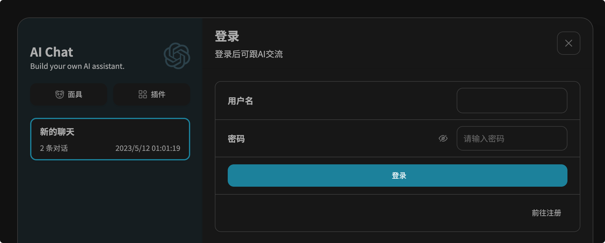

<div align="center">


<h1 align="center">AI Chat Web</h1>
<a href="#一键部署">一键部署</a>
</div>

Based on [ChatGPT-Next-Web](https://github.com/Yidadaa/ChatGPT-Next-Web.git), this repository added some magic functions, like login, register...

本项目是在[ChatGPT-Next-Web](https://github.com/Yidadaa/ChatGPT-Next-Web.git)的基础上增加登录，注册等功能（注意，由于登录注册需要后台支持，因此本项目需要单独部署后端服务才可以运行）

**本项目不再支持在vercel上正常运行**

**This projecrt can NOT run on the vercel.**

## 演示地址

前台 http://chat.nanjiren.online

后台 http://chat.nanjiren.online:8080
账号：aichat
密码：aichatadmin

**温馨提示，由于后台开放，请勿在演示站中输入敏感信息**

本项目区分社区版，及Pro版

## 社区版功能 Community Function

1. 用户管理（User Management）（√）
2. 额度管理（Quota Management）（√）
3. 注册额度赠送（√）
3. 邮箱验证码注册，图形验证码注册（Email Register, Verification Code For Registering）（√）
3. 网站标题及Logo定制（Customization of Website Title and Logo）
3. 自定义敏感词拦截
3. 基于用户的调用频率限制  Call Rate Limit 
3. 修改密码（Change password）
3. 绘图功能（midjourney）
4. ...


## Pro版功能规划 Pro Function Plan

1. 邀请机制（邀请赠送额度）（Registration Invitation Mechanism）
2. 服务端消息保存（Chat Saved by Server）
3. 仪表盘（新增用户数曲线图、聊天数量曲线图）Dashboard
4. 对接支付系统 Pay
5. 对接发卡平台
6. 多模型支持（Claude、Bard……）
7. 更多惊喜 More


## 预览Preview

### 聊天 Chat


### 登录 Login



### 注册 Register


### 个人中心 Profile


本项目需要依赖特定的后端，以及相应的后台管理前端项目。

This project depends on the given projects below.

### AI Chat Console(front-end project)

https://github.com/Nanjiren01/AIChatConsole

#### 会员列表 Member List


#### 次数变动记录/手动添加次数 Quota Record


### AI Chat Admin(back-end project)

https://github.com/Nanjiren01/AIChatAdmin

## 一键部署

1. 在云厂商购买一台合适配置的服务器，操作系统选择CentOS 7.9（其他版本未测试）
2. 在安全组中放行80端口和8080端口
3. 连接云服务器，在命令行中运行以下代码

```shell
bash <(curl -s https://raw.githubusercontent.com/Nanjiren01/AIChatWeb/main/scripts/setup.sh)
```

命令运行过程中，需要输入超级管理员的账号和密码，如下所示：

```text
Please input the super admin username. 
Only letters and numbers are supported, the length should between 6 and 20, and they cannot start with a number.
Username: aichat888
Super Admin Username is valid.
Please input the super admin password. 
Only letters and numbers are supported, and the length should between 6 and 20. 
You can change it on the web page after the Application running
Password: aichat888
Super Admin Password is valid.
```

当出现以下提示，说明部署成功

```shell
[+] Running 5/5
 ✔ Network root_default      Created
 ✔ Container aichat-db       Started
 ✔ Container aichat-admin    Started
 ✔ Container aichat-console  Started
 ✔ Container aichat-web      Started         
```

稍等几秒钟应用初始化，即可打开http://IP访问前台页面，打开http://IP:8080访问后台服务。

由于在命令行中设定的密码较为简单（只包含字母和数字），建议应用启动后，尽快进入后台修改超管密码。

## License 
本仓库是基于仓库 [Yidadaa's ChatGPT-Next-Web](https://github.com/Yidadaa/ChatGPT-Next-Web) 的996许可证，以[MIT license](./LICENSE)的形式重新分发。


### 加入QQ交流群、微信群获取更多内容


## Pro版本

### pro版本获取，请关注知识星球

### 加入知识星球，有可能获得免费定制服务


当前星球价格为98元，随着功能的不断完善，知识星球价格逐步提升

### pro版本规划路线（从上往下逐步完成）

1. 对接支付系统 Pay
2. 邀请机制（邀请赠送额度）
3. 仪表盘（新增用户数曲线图、聊天数量曲线图）
4. 对接发卡平台
5. 服务端消息保存（Chat Saved by Server）
6. 多模型支持（Claude、Bard……）
