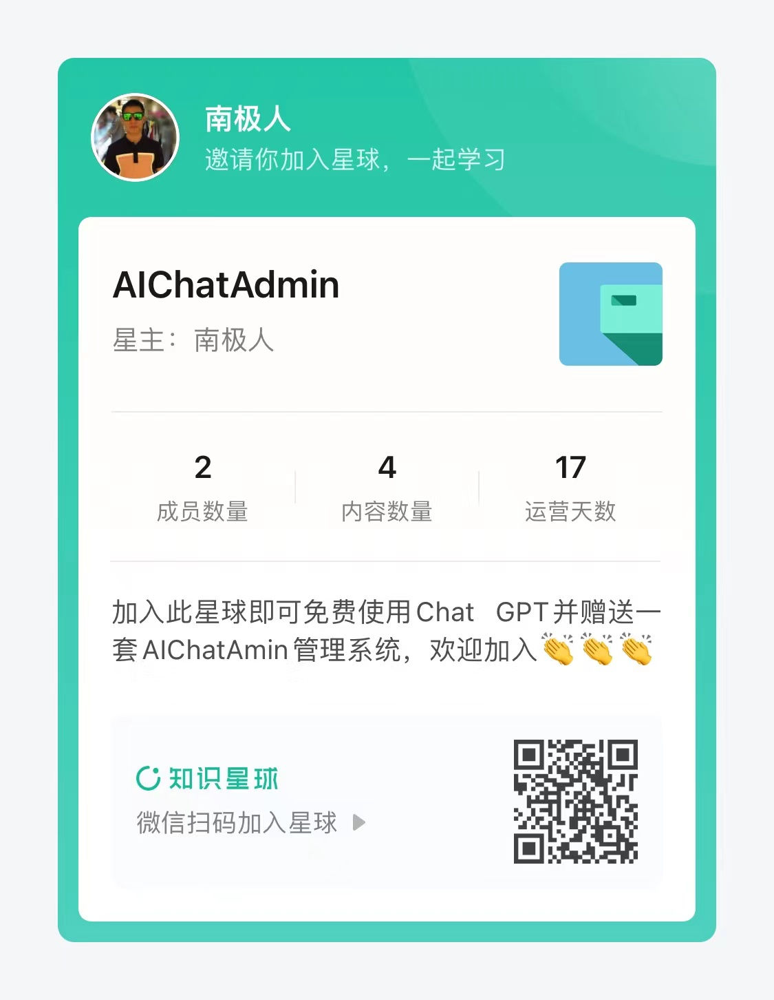

<h1 align="center">AI Chat Web</h1>

Based on [ChatGPT-Next-Web](https://github.com/Yidadaa/ChatGPT-Next-Web.git), this repository added some magic functions, like login, register...

本项目是在[ChatGPT-Next-Web](https://github.com/Yidadaa/ChatGPT-Next-Web.git)的基础上增加登录，注册等功能（注意，由于登录注册需要后台支持，因此本项目需要单独部署后端服务才可以运行）

**本项目不再支持在vercel上正常运行**

**This projecrt can NOT run on the vercel.**

## 功能（Function）

1. 用户管理（User Management）（√）
2. 额度管理（Quota Management）（√）
3. 注册额度赠送（√）
4. 图形验证码注册（Verification Code For Registering）
5. 服务端消息保存（Chat Saved by Server）
6. ...

## 预览Preview

### 聊天 Chat

### 登录 Login

### 注册 Register

### 个人中心 Profile

本项目需要依赖特定的后端，以及相应的后台管理前端项目。

This project depends on the given projects below.

### AI Chat Console(front-end project)

https://github.com/Nanjiren01/AIChatConsole

#### 会员列表 Member List

#### 次数变动记录/手动添加次数 Quota Record

### AI Chat Admin(back-end project)

https://github.com/Nanjiren01/AIChatAdmin

后端项目正在整理中……

## License 
see [ChatGPT-Next-Web](https://github.com/Yidadaa/ChatGPT-Next-Web.git)

### 本项目QQ交流群

### 更多功能和最新资讯，请关注知识星球

1. 修改密码（Change password）
2. 邮箱验证码注册，图形验证码注册（Email Register, Verification Code For Registering）
3. 网站标题和Logo定制（Customization of Website Title and Logo）
4. 邀请机制（邀请赠送额度）（Registration Invitation Mechanism）
5. 绘图功能（midjourney）
6. 基于用户的调用频率限制  Call Rate Limit 
7. 敏感词拦截
8. 对接支付系统 Pay
9. 对接发卡平台
10. 多模型支持（Claude、Bard……）
11. 更多惊喜 More

