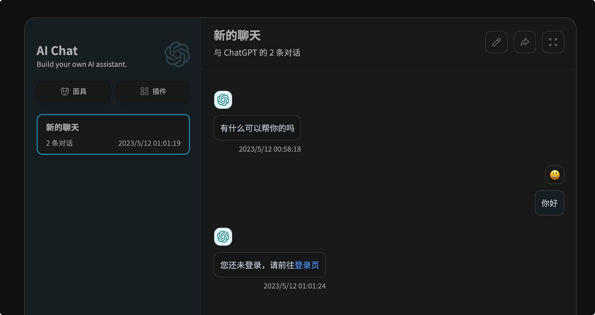
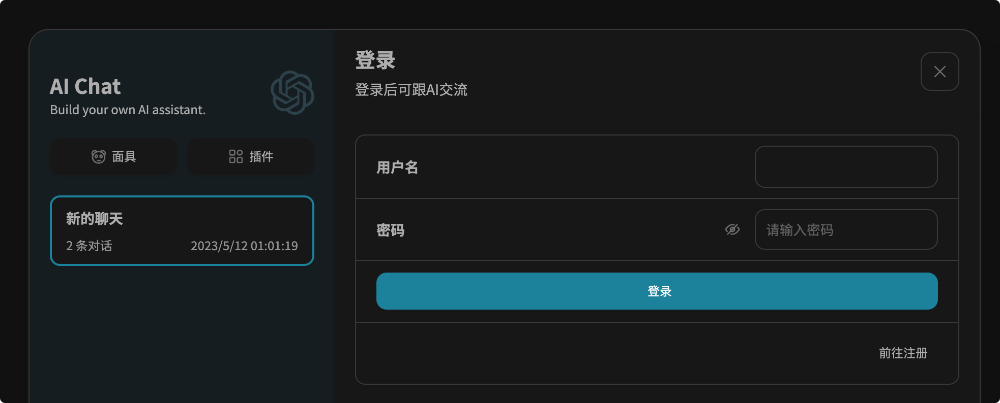
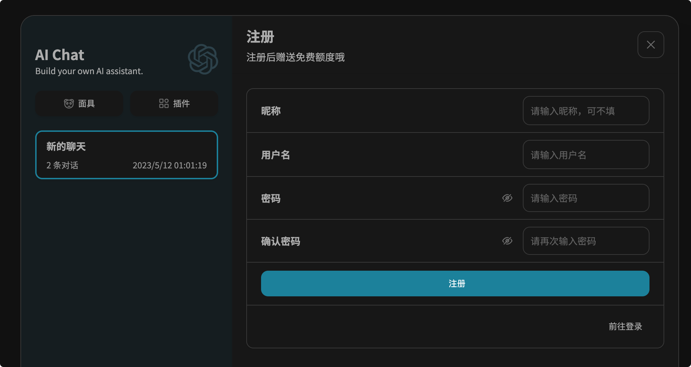
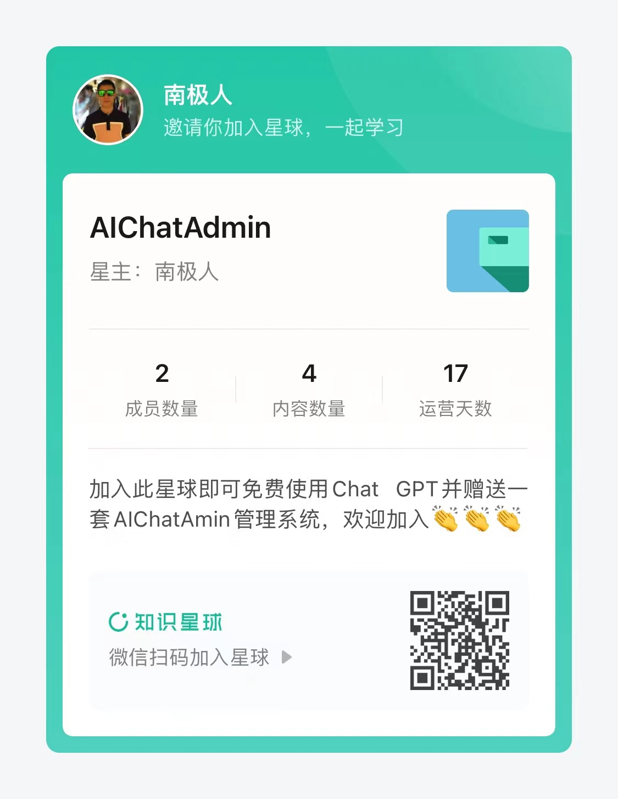

<h1 align="center">AI Chat Web</h1>

在项目[ChatGPT-Next-Web](https://github.com/Yidadaa/ChatGPT-Next-Web.git)的基础上增加登录，注册等功能

## 规划功能

1. 验证码注册
2. 用户管理
3. 额度管理
4. 服务端对话保存
5. 

## 预览

### 前往登录

### 登录页

### 注册页

### 后台管理
https://github.com/Nanjiren01/AIChatConsole

### 后端工程
https://github.com/Nanjiren01/AIChatAdmin

### 本项目许可证同[ChatGPT-Next-Web](https://github.com/Yidadaa/ChatGPT-Next-Web.git)

### 本项目源码优先发布于AIChatAdmin知识星球

### 本项目QQ交流群

