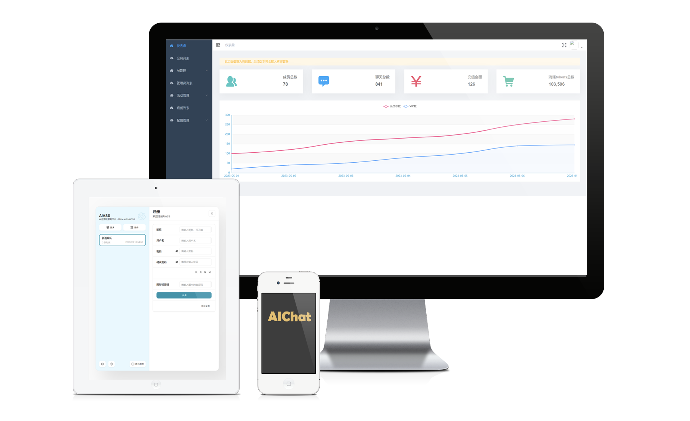
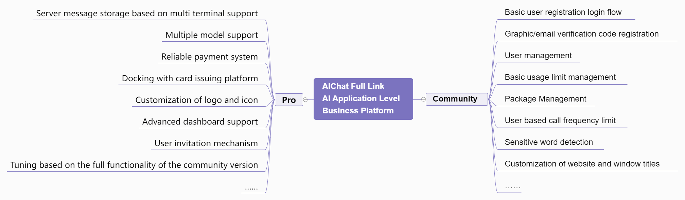
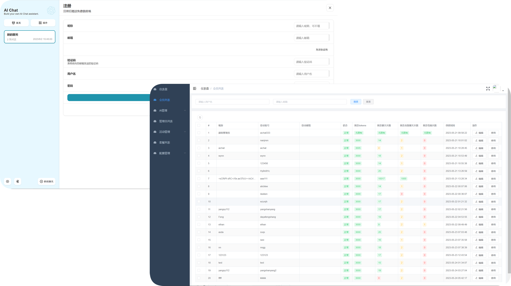
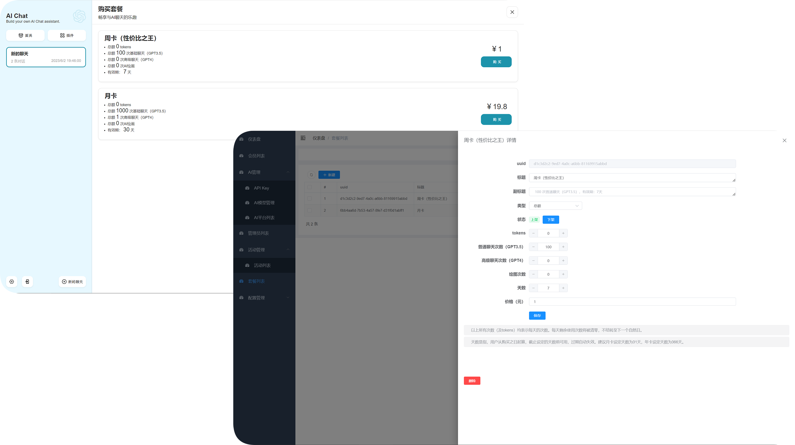
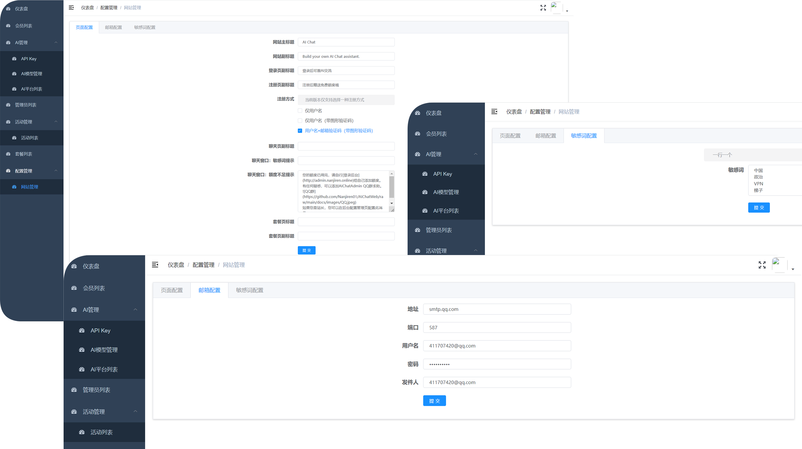
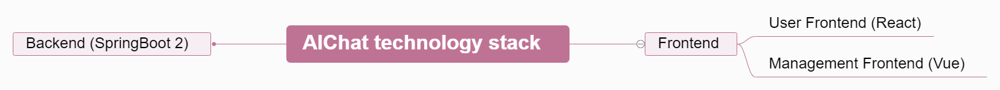

> **Note: Deployment on Vercel is no longer supported in this project**

<h1 align="center">AIChat</h1>

[**简体中文**](./README.md) | **English**

This project is based on the [ChatGPT-Next-Web](https://github.com/Yidadaa/ChatGPT-Next-Web.git) open source project for secondary development, adding user registration and login, user management, package management and other functions, and providing self-deployable solutions. 

<table>
    <tbody>
      <tr>
        <td>
 <a href="https://nanjiren.online/"> 🌐 Official website </a>
        </td>
        <td>
 <a href="#-demo site"> 🎦 demo site </a>
        </td>
        <td>
 <a href="https://www.nanjiren.online/start/deploy/"> 🚀 one-click deployment </a>
        </td>
        <td>
 <a href="https://www.nanjiren.online/excellentcase/"> 👑 Good case </a>
        </td>
        <td>
 <a href="https://www.nanjiren.online/updatelog/"> 📝 changelog</a>
        </td>        
        <td>
 <a href="https://www.nanjiren.online/cooperation-communication/"> 💬 exchange discussion</a>
        </td>
      </tr>
    </tbody>
  </table>

## 🤩 Version features

## 😍 Platform preview

**User Registration & Management**

**Package Purchase & Management**

**Other Features Showcase**

## 🎦 Demo site
| Type | URL |
| ---- | ---- |
| User front-end | https://chat.nanjiren.online |
| Manage frontends | https://admin.nanjiren.online |

**Demo Account** - Account: `aichat` Password: `aichatadmin`

## 🎯 Development plan
**Community Edition**

| Features | Progress |
| --------------------------------------------------------- | -------- |
| User Management |    ✔ Completed |
| Quota Management |    ✔ Completed |
| Package customization |   ✔ Completed |
| Registration quota bonus |    ✔ Completed |
| Email verification code registration |    ✔ Completed |
| Graphic Captcha Registration |    ✔ Completed |
| Custom sensitive word blocking |   ✔ Completed |
| Limit based on user call frequency |   ✔ Completed |
| Website title and window title customization |   ✔ Completed |
| Change Password |   In progress |
| Drawing functions |   In progress |

[**Pro Edition**](https://www.nanjiren.online/price/)

| Features | Progress |
| ------------------------------------------------------------ | -------- |
Enhanced Community Edition Full Feature Support |  ✔ Completed |
| Multi-model support | Long-term |
| Dashboard | In progress |
| Invitation mechanism | In progress |
| Docking payment system | In progress |
| Docking card issuing platform | In progress |
| Server-side message saving | In progress |

## 🎮 Technology stack

## 🐵 Development team
- [@Nanjiren01](https://github.com/Nanjiren01)
- [@yeguangsuixing](https://github.com/yeguangsuixing)
- [@zeraturing](https://github.com/zeraturing)
- [@AI-ASS](https://github.com/AI-ASS)

## 📖 License 
This repository is based on the 996 license of the repository [Yidadaa's ChatGPT-Next-Web](https://github.com/Yidadaa/ChatGPT-Next-Web), redistributed as [MIT License](./LICENSE). 

